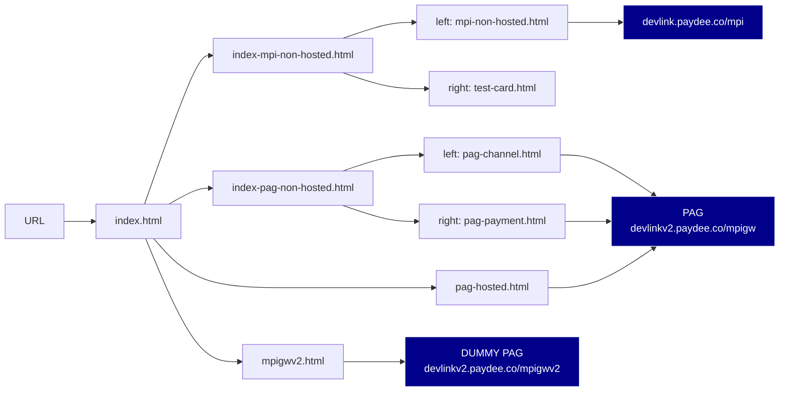
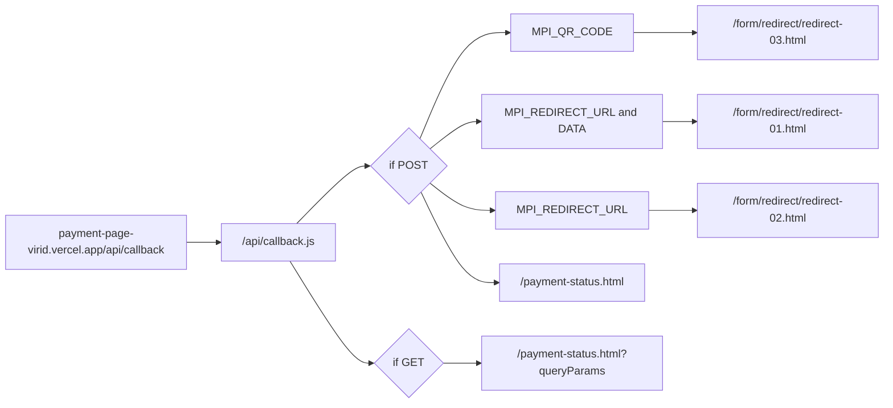

# Project Architecture

This documentation provides a visual overview of our payment UAT system.

## Flowchart Diagram
*The high-level navigation and iframe routing logic.*

```mermaid
graph LR
    URL --> Index["index.html"]
    
    Index --> MPI["index-mpi-non-hosted.html"]
    Index --> PAG_Non["index-pag-non-hosted.html"]
    Index --> PAG_Hosted["pag-hosted.html"]
    Index --> Dummy["mpigwv2.html"]
    
    MPI --> MPI_L["left: mpi-non-hosted.html"]
    MPI --> MPI_R["right: test-card.html"]
    MPI_L --> Target1["devlink.paydee.co/mpi"]
    
    PAG_Non --> PAG_L["left: pag-channel.html"]
    PAG_Non --> PAG_R["right: pag-payment.html"]
    PAG_L --> Target2["PAG<br/>devlinkv2.paydee.co/mpigw"]
    PAG_R --> Target2
    
    PAG_Hosted --> Target2
    Dummy --> Target3["DUMMY PAG<br/>devlinkv2.paydee.co/mpigwv2"]

    style Target1 fill:#00008B,stroke:#fff,color:#fff
    style Target2 fill:#00008B,stroke:#fff,color:#fff
    style Target3 fill:#00008B,stroke:#fff,color:#fff
```

```mermaid
graph LR
    Callback["payment-page-virid.vercel.app/api/callback"] --> API_JS["/api/callback.js"]
    
    API_JS --> IfPOST{"if POST"}
    IfPOST --> QR["MPI_QR_CODE"]
    IfPOST --> DATA["MPI_REDIRECT_URL and DATA"]
    IfPOST --> URL_ONLY["MPI_REDIRECT_URL"]
    IfPOST --> Status["/payment-status.html"]
    
    QR --> R3["/form/redirect/redirect-03.html"]
    DATA --> R1["/form/redirect/redirect-01.html"]
    URL_ONLY --> R2["/form/redirect/redirect-02.html"]
    
    API_JS --> IfGET{"if GET"}
    IfGET --> StatusQuery["/payment-status.html?queryParams"]


```
